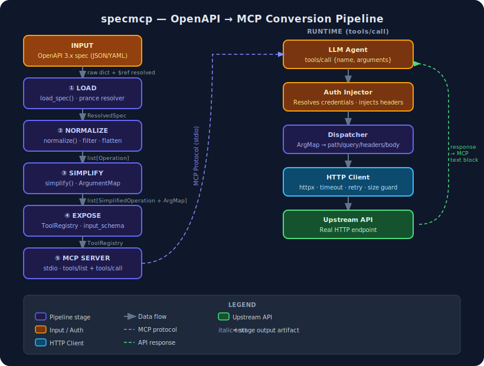

# specmcp — Conversion Process

specmcp converts any OpenAPI 3.x spec into a live MCP server without generating code.
The pipeline runs once at startup; the MCP server proxy is what runs at runtime.

---

## Pipeline stages

### ① LOAD

`specmcp.core.load.load_spec(path)`

Reads the spec file (JSON or YAML) and resolves all `$ref` pointers into a single
in-memory dict using `prance.ResolvingParser`. The result is a fully-dereferenced
`ResolvedSpec` ready for normalisation.

### ② NORMALIZE

`specmcp.core.normalize.normalize(resolved_spec, ...)`

Walks every path/method pair and produces a flat `list[Operation]`. Each `Operation`
captures: HTTP method, path template, server URL, parameter list, request body schema,
response schemas, security requirements, tags, and deprecation status. Filter flags
(`include_tags`, `exclude_tags`, `include_operations`, `exclude_operations`,
`include_deprecated`) are applied here.

### ③ SIMPLIFY

`specmcp.core.simplify.simplify(operations, config)`

Maps each `Operation` to a `SimplifiedOperation` that an LLM can use directly:

- **Tool name** — derived from `operationId` or synthesised from method + path.
- **Description** — trimmed to `max_description_chars`.
- **`input_schema`** — a JSON Schema `object` listing every parameter the LLM must
  supply, with complex or unsupported types flattened to `string`.
- **`ArgumentMap`** — explicit mapping from each LLM key to its HTTP destination
  (`path`, `query`, `header`, `cookie`, `body_field`, or `body_root`) together with
  OpenAPI style/explode metadata.

The ArgumentMap is the round-trip invariant: for any valid `input_schema` argument
dict, the Dispatcher must be able to reconstruct a complete HTTP request. If it
cannot, that is a bug in the Simplify stage, not a user error.

### ④ EXPOSE

`specmcp.core.expose.ToolRegistry.build(simplified_ops, config)`

Wraps each `SimplifiedOperation` in a `ToolDefinition` and stores them in a
`ToolRegistry`, keyed by tool name. The registry is the single authoritative source
for `tools/list` responses and `tools/call` lookups at runtime.

### ⑤ MCP SERVER

`specmcp.cli.serve` — `mcp.server.Server` over stdio

The MCP server registers two handlers:

- **`tools/list`** — returns the ToolRegistry contents as MCP `Tool` objects.
- **`tools/call`** — looks up the tool, runs argument validation, then delegates to
  the Dispatcher.

---

## Runtime dispatch (tools/call)

When an LLM issues a `tools/call` request the following happens in order:

1. **Auth Injector** — resolves credentials from env / config at startup; injects
   them into the outgoing request headers or query params without ever logging
   the raw value (`SensitiveStr.reveal()` is called only at injection time).

2. **Dispatcher** — walks the `ArgumentMap` to build path variables, query params,
   headers, and body; fills the path template; selects JSON vs form encoding.

3. **HTTP Client** — sends the request via `httpx.AsyncClient` (`trust_env=False`).
   Enforces timeout, retry on configured status codes, response-size guard, and
   body truncation before decoding.

4. **Result formatting** — the response body is pretty-printed if JSON, then
   returned as an MCP `text` content block. A `[Response truncated]` suffix is
   appended when the body was cut.

---

## Key design decisions

| Decision | Rationale |
|---|---|
| Proxy mode (no codegen) | Works with any spec, zero maintenance when the API changes |
| `ArgumentMap` as explicit contract | Errors surface at Simplify time, not at runtime |
| `SensitiveStr` | Credentials cannot leak via logs, repr, or error messages |
| `trust_env=False` | Prevents sandbox HTTP_PROXY / SOCKS env vars from hijacking requests |
| anyio memory streams for E2E tests | Fully hermetic, no ports, no subprocesses |
